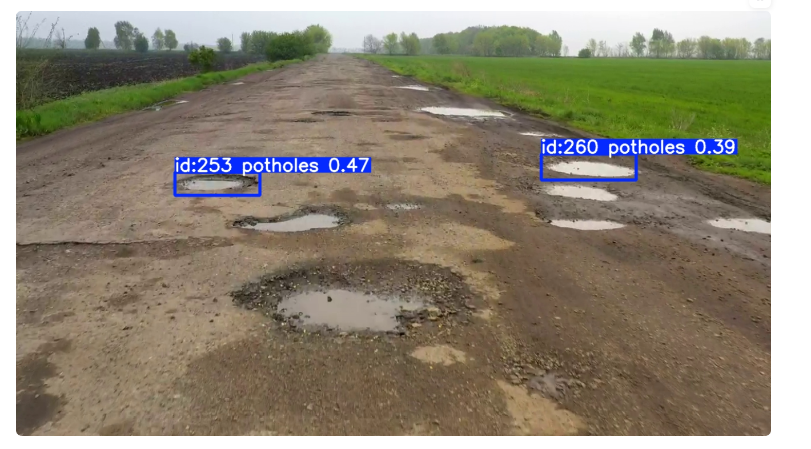
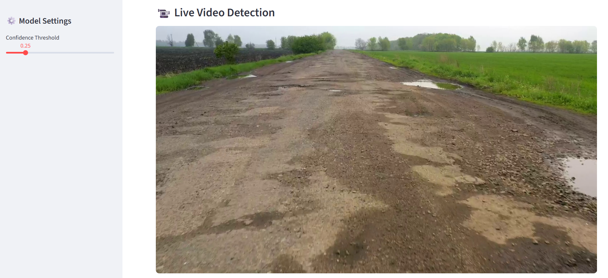
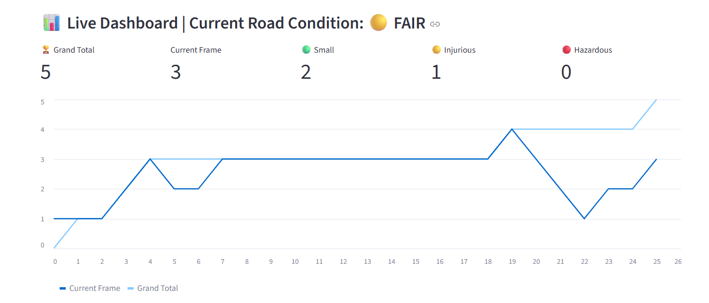

# Road Safety Pothole Detection

A computer vision-based road safety system for detecting potholes in road images and videos using YOLO11. The project also includes pothole tracking, severity classification, road-condition assessment, and an interactive Streamlit dashboard.
## Project Demo

### Pothole Detection



### Video Detection & Tracking



### Road Condition Dashboard



## Project Overview

This project was developed as a computer vision application to identify potholes from road imagery and video.

The detection model was trained using a dataset prepared through Roboflow and the YOLO11n object-detection architecture. The trained model was then integrated into a Streamlit application for practical image and video analysis.

## Key Features

- Pothole detection from road images
- Pothole detection from videos
- Object tracking across video frames
- Unique pothole identification
- Pothole severity classification
- Overall road-condition assessment
- Interactive Streamlit dashboard
- Detection results with bounding boxes and confidence scores

## Technology Stack

- Python
- YOLO11
- Ultralytics
- Roboflow
- OpenCV
- Streamlit
- ONNX
- Pandas
- Pillow

## Project Workflow

```text
Road Images / Videos
        ↓
     Roboflow
        ↓
 Dataset Preparation
        ↓
     YOLO11n
        ↓
 Model Training
        ↓
   best.onnx
        ↓
 Streamlit Application
        ↓
Pothole Detection & Tracking
        ↓
Severity Classification
        ↓
Road Condition Assessment